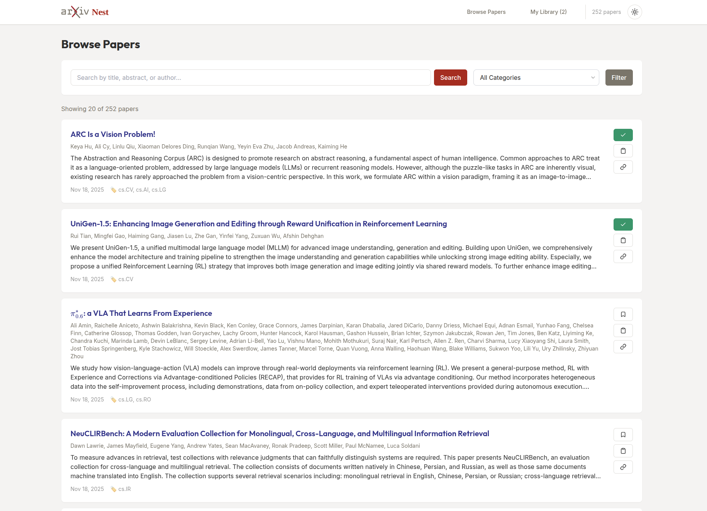
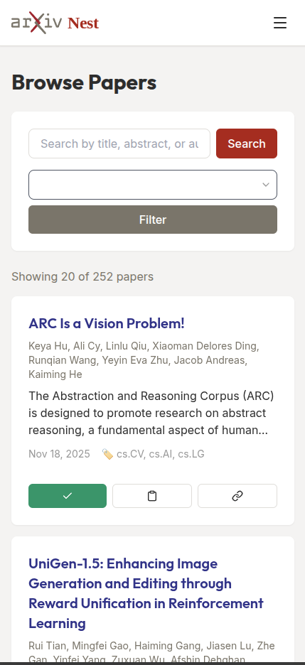

# ArXiv Nest 


A lightweight, self-hosted Go application for fetching, indexing, and browsing arXiv papers. Built with simplicity and minimalism in mind.

  
[](#) 🤝 [](#) 

## Screenshots

### Desktop Interface


### Mobile Interface


## Features

- 🔍 **Fetch & Index**: Automatically fetch papers from arXiv based on categories and keywords
- 📖 **Browse**: Clean, responsive UI for browsing papers
- 📱 **Mobile Ready**: Fully responsive design with hamburger menu and touch-friendly controls
- 💾 **Library**: Save papers to your personal library
- 🏷️ **Tags**: Organize papers with custom tags
- ✅ **Read Status**: Track which papers you've read
- 🔎 **Search**: Search by title, abstract, or author
- ⚡ **Fast & Interactive**: HTMX-powered interactions with instant feedback (Toasts, NProgress)
- ⌨️ **Keyboard Shortcuts**: Power user controls for navigation and search
- 🌙 **Dark Mode**: System-aware light/dark theme with persistent toggle
- 📄 **Single Binary**: Deploy as a single executable with SQLite database
- 🐳 **Docker**: Run in a container with one command


## Quick Start

### Prerequisites

- Go 1.22 or higher
- SQLite3 (for CGO)
- Make (optional, for convenience)

### Installation

1. **Clone the repository**:
   ```bash
   git clone https://github.com/Nannigalaxy/arxiv-nest-go.git
   cd arxiv-nest-go
   ```

2. **Install dependencies**:
   ```bash
   make deps
   ```

3. **Build the application**:
   ```bash
   make build
   ```

4. **Run database migrations**:
   ```bash
   make migrate
   ```

5. **Fetch initial papers**:
   ```bash
   make fetch
   ```

6. **Start the server**:
   ```bash
   make run
   ```

7. **Open your browser** and navigate to `http://localhost:8080`

## Configuration

Configuration can be done via `config.yaml` or environment variables.

### config.yaml

```yaml
server:
  host: "0.0.0.0"
  port: 8080

database:
  path: "./data/arxiv.db"

arxiv:
  categories:
    - "cs.AI"
    - "cs.LG"
    - "cs.CL"
    - "cs.CV"
  keywords: []
  max_results: 100
  fetch_interval: 24h
  rate_limit_delay: 3s

ui:
  page_size: 20
```

### Environment Variables

- `SERVER_HOST`: Server host (default: `0.0.0.0`)
- `SERVER_PORT`: Server port (default: `8080`)
- `DB_PATH`: Database file path (default: `./data/arxiv.db`)
- `ARXIV_MAX_RESULTS`: Maximum papers to fetch per request (default: `100`)
- `UI_PAGE_SIZE`: Papers per page (default: `20`)

## Usage

### CLI Commands

```bash
# Start the web server (default command)
./bin/arxiv-nest-go server

# Manually fetch papers from arXiv
./bin/arxiv-nest-go fetch

# Run database migrations
./bin/arxiv-nest-go migrate
```

### Web Interface

- **Browse Papers**: Navigate to `/` to see all fetched papers
- **Library**: Navigate to `/library` to see your saved papers
- **Paper Details**: Click on any paper title to see full details
- **Save to Library**: Click "Save to Library" button on any paper
- **Add Tags**: On the paper detail page, add custom tags
- **Mark as Read**: Toggle read status for papers in your library
- **Search**: Use the search bar to find papers by keyword
- **Theme**: Toggle between Light and Dark mode (top right)
- **Go to Top**: Use the floating arrow button to scroll to top

### Keyboard Shortcuts

| Key | Action |
| --- | --- |
| `/` | Focus Search Bar |
| `Esc` | Blur Input / Close Menus |
| `j` | Scroll Down |
| `k` | Scroll Up |

### Background Fetching

The application automatically fetches new papers based on the `fetch_interval` configured in `config.yaml`. By default, it fetches every 24 hours.

## Docker

### Build and Run

```bash
# Build Docker image
make docker-build

# Run container
make docker-run
```

The application will be available at `http://localhost:8080`.

### Docker Compose (Optional)

Create a `docker-compose.yml`:

```yaml
version: '3.8'

services:
  arxiv-nest-go:
    build: .
    ports:
      - "8080:8080"
    volumes:
      - ./data:/root/data
    environment:
      - SERVER_HOST=0.0.0.0
      - SERVER_PORT=8080
      - DB_PATH=/root/data/arxiv.db
    restart: unless-stopped
```

Run with:
```bash
docker-compose up -d
```

## Development

### Project Structure

```
arxiv-nest-go/
├── cmd/
│   └── server/
│       └── main.go              # Entry point
├── internal/
│   ├── arxiv/
│   │   ├── client.go            # arXiv API client
│   │   └── parser.go            # Atom feed parser
│   ├── db/
│   │   ├── db.go                # Database connection
│   │   ├── schema.sql           # SQLite schema
│   │   └── queries.go           # SQL queries
│   ├── models/
│   │   └── models.go            # Data structures
│   ├── server/
│   │   ├── server.go            # HTTP server
│   │   ├── handlers.go          # HTTP handlers
│   │   └── templates.go         # Template helpers
│   └── config/
│       └── config.go            # Configuration
├── web/
│   ├── templates/
│   │   ├── base.html            # Base layout
│   │   ├── list.html            # Paper list
│   │   ├── detail.html          # Paper detail
│   │   └── library.html         # Library view
│   └── static/
│       └── styles.css           # Custom CSS
├── config.yaml                   # Configuration
├── Dockerfile                    # Container build
├── Makefile                      # Build automation
└── README.md
```

### Running Tests

```bash
make test
```

### Code Formatting

```bash
make fmt
```

### Live Reload (Development)

Install [air](https://github.com/cosmtrek/air) for live reloading:

```bash
make dev
```

## Architecture

### Data Flow

1. **Scheduler** → Calls `arxiv.FetchNew()` periodically
2. **ArXiv Client** → Fetches Atom feed from arXiv API
3. **Parser** → Converts feed entries to Paper models
4. **Database** → Upserts papers (deduplication by arXiv ID)
5. **Web UI** → Reads from database, displays papers
6. **User Actions** → Update library, tags, read status in database

### Database Schema

- **papers**: Core paper metadata from arXiv
- **library**: User's saved papers with read status
- **tags**: User-defined tags
- **paper_tags**: Many-to-many relationship between papers and tags

## Technology Stack

- **Language**: Go 1.22+
- **Database**: SQLite3
- **Web Framework**: chi router
- **Templates**: html/template (stdlib)
- **CSS**: Tailwind CSS (CDN)
- **Icons**: Lucide Icons
- **Interactivity**: HTMX
- **UX**: NProgress, Toast Notifications
- **Dependencies**: Minimal (see go.mod)

## Contributing

Contributions are welcome! Please follow these guidelines:

1. Fork the repository
2. Create a feature branch
3. Make your changes
4. Add tests if applicable
5. Run `make fmt` and `make test`
6. Submit a pull request

## License

MIT License - see LICENSE file for details

## Acknowledgments

- Inspired by [Arxiv Sanity Preserver](https://github.com/karpathy/arxiv-sanity-preserver)
- Built with the Unix philosophy: do one thing well
- Follows KISS (Keep It Simple, Stupid) and DRY (Don't Repeat Yourself) principles

## Roadmap

### Phase 2 (Future)

- [ ] Recommendations based on TF-IDF similarity
- [ ] Full-text search with indexing
- [ ] Export library to CSV/JSON/BibTeX
- [ ] OPML/JSON feed for RSS readers
- [ ] REST API
- [ ] Email/Slack notifications

## Support

For issues, questions, or contributions, please open an issue on GitHub.

---

**Made with ❤️ and Go**
